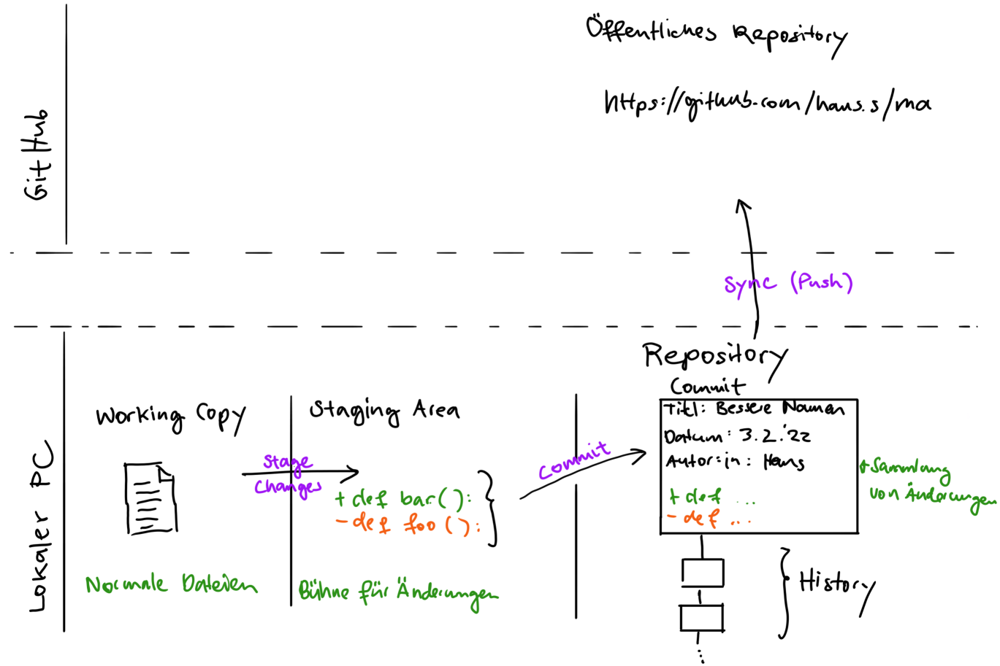

# Informationen zur Maturaarbeit im Fach Informatik


### Funktionsweise Git



### Ordnerstruktur

```
+ doc                (die gesamte Dokumentation)
  + linksammlung.md  (Links zu YouTube etc. mit Datum und Beschreibung)
  + mvp.md           (Minimal viable product description)
+ README.md          (Übersicht)
```
